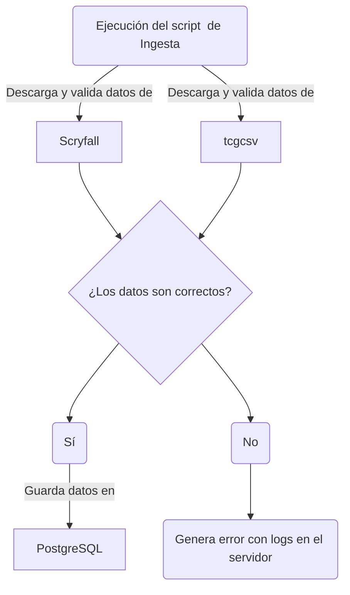

# Proceso de carga de datos en el servidor

## Diagrama simplifado

```mermaid
flowchart TD
inicio(Ejecución del script  de Ingesta)
inicio --> |Descarga y valida datos de | ScryFall[Scryfall]
inicio --> |Descarga y valida datos de | tcgcsv[tcgcsv]
ScryFall --> DatosValidos{¿Los datos son correctos?}
tcgcsv --> DatosValidos
DatosValidos -->si(Sí)
DatosValidos -->no(No)
no --> error(Genera error con logs en el servidor)
si --> |Guarda datos en| db[PostgreSQL]
```

## Requerimientos

### Lenguaje de programación

Python 3.14 o superior.

### Librerías

Pydantic 2.14.3 o superior